<div align="center">

# ⚡ Distribution Grid Simulation

### *Day-Ahead Optimization for Smart Energy Systems*


**A sophisticated Python framework for modeling distribution grid operations with renewable energy integration and intelligent battery management**

[🚀 Quick Start](#-quick-start) • [📊 Results](#-results) • [🔬 Technical Deep Dive](#-technical-architecture) • [💡 Use Cases](#-real-world-applications)

---

</div>

## 🌟 Project Highlights

<table>
<tr>
<td width="50%">

### 🎯 **Peak Reduction**
Achieves **29.4% reduction** in peak power demand through intelligent battery scheduling

</td>
<td width="50%">

### 🔋 **Smart Storage**
10 kWh BESS with adaptive control algorithms for optimal charge/discharge cycles

</td>
</tr>
<tr>
<td width="50%">

### ☀️ **Solar Integration**
Realistic PV generation modeling with time-series irradiance patterns

</td>
<td width="50%">

### 📉 **Congestion Relief**
21.6% reduction in grid congestion through predictive load management

</td>
</tr>
</table>

---

## 🎬 What This Project Does

This simulation framework demonstrates **next-generation grid management** capabilities by modeling a 24-hour operational cycle of a distribution feeder with:

```mermaid
graph LR
    A[🏠 Base Load] --> D[⚖️ Net Load Calculator]
    B[☀️ PV Generation] --> D
    D --> E[🤖 Battery Controller]
    E --> F[🔌 Grid Interface]
    F --> G[📊 Analytics Engine]
    style D fill:#4CAF50
    style E fill:#2196F3
    style G fill:#FF9800
```



> **💡 Key Innovation:** Implements predictive congestion management through day-ahead optimization, reducing peak demand and infrastructure stress while maximizing renewable energy utilization.

---

## 🚀 Quick Start

### Prerequisites

```bash
Python 3.11+  |  pip  |  git
```

### Installation

```bash
# Clone the repository
git clone https://github.com/Hassan-Abidi/grid-simulation.git
cd grid-simulation

# Install dependencies
pip install -r requirements.txt

# Run simulation
python3 simulate_grid.py
```

### ⚡ One-Line Setup

```bash
git clone https://github.com/Hassan-Abidi/grid-simulation.git && cd grid-simulation && pip install -r requirements.txt && python3 simulate_grid.py
```

---

## 📊 Results

### 🎯 Performance Metrics

<div align="center">

| 📈 Metric | 🔴 Baseline | 🟢 Optimized | 💚 Improvement |
|:----------|:------------|:-------------|:---------------|
| **Peak Power** | 8.50 kW | 6.00 kW | **↓ 29.4%** 🎉 |
| **Congestion Index** | 359.00 | 281.62 | **↓ 21.6%** 🎊 |
| **Load Factor** | 0.54 | 0.68 | **↑ 25.9%** ✨ |

</div>

### 📉 Visualization Dashboard


<details>
<summary>🔍 <b>Click to see detailed analysis</b></summary>

#### Panel 1: Load & Generation Profiles
- **Blue Line:** Residential base load following typical daily patterns
- **Orange Line:** Solar PV generation with midday peak at 6.2 kW
- **Green Dashed:** Net load showing the balance between consumption and generation

#### Panel 2: Battery Operation
- **Positive Values:** Battery discharging to support grid during peak hours
- **Negative Values:** Battery charging during off-peak and high solar generation periods
- **Zero Crossings:** Optimal transition points determined by the control algorithm

#### Panel 3: Grid Power & Battery SOC
- **Green Solid:** Final grid power demand after battery optimization
- **Red Dashed:** Battery state of charge (SOC) throughout the day
- **Key Insight:** SOC management ensures battery availability for evening peak shaving

</details>

---

## 🏗️ Technical Architecture

### 🔧 System Components

```python
📦 grid-simulation/
├── 🎯 simulate_grid.py          # Core simulation engine
│   ├── load_profiles()          # Data ingestion layer
│   ├── calculate_net_load()     # Load-generation balancing
│   ├── initialize_battery()     # BESS state initialization
│   ├── battery_control()        # Peak-shaving algorithm ⭐
│   └── plot_results()           # Visualization generator
├── 🔄 generate_profiles.py      # Synthetic data generator
├── 📁 profiles/                 # Time-series input data
│   ├── base_load.csv           # Hourly consumption (kW)
│   ├── pv_generation.csv       # Solar output (kW)
│   └── battery_specs.csv       # BESS parameters
└── 📊 simulation_results.csv    # Detailed output data
```

### 🤖 Battery Control Algorithm

The intelligent control system implements a **dual-threshold strategy**:

<table>
<tr>
<th>Mode</th>
<th>Trigger Condition</th>
<th>Action</th>
<th>Objective</th>
</tr>
<tr>
<td>🔋 <b>Discharge</b></td>
<td><code>Net Load > 6.0 kW</code></td>
<td>Release stored energy</td>
<td>Peak shaving</td>
</tr>
<tr>
<td>⚡ <b>Charge</b></td>
<td><code>Net Load < 2.0 kW</code></td>
<td>Store excess energy</td>
<td>Valley filling</td>
</tr>
<tr>
<td>⏸️ <b>Idle</b></td>
<td><code>2.0 ≤ Net Load ≤ 6.0 kW</code></td>
<td>No action</td>
<td>Preserve SOC</td>
</tr>
</table>

**Constraints Enforced:**
- ⚠️ Power limits: `-5 kW ≤ P_battery ≤ +5 kW`
- 🔒 SOC bounds: `0 kWh ≤ SOC ≤ 10 kWh`
- 🎯 Initial condition: `SOC(t=0) = 5 kWh` (50% capacity)

### 📐 Congestion Proxy Metric

Novel congestion quantification using **quadratic penalty function**:

```
Congestion Index = Σ[P_grid(t)²] for t ∈ [0, 23] hours
```

**Why Squared?** This metric penalizes peak flows exponentially, aligning with:
- Thermal losses (I²R heating)
- Voltage drop severity
- Infrastructure stress levels
- Transformer aging acceleration

---

## 💡 Real-World Applications

<table>
<tr>
<td width="50%">

### 🏢 **Utility Operations**
- Distribution planning
- Capacity deferral analysis
- Peak demand management
- Grid modernization studies

</td>
<td width="50%">

### 🔬 **Research & Academia**
- DER integration studies
- Congestion management research
- Renewable hosting capacity
- Market mechanism design

</td>
</tr>
<tr>
<td width="50%">

### 💼 **Commercial Applications**
- Microgrid optimization
- Behind-the-meter storage
- Demand response programs
- Energy arbitrage strategies

</td>
<td width="50%">

### 🎓 **Education & Training**
- Power systems courses
- Smart grid workshops
- Energy storage seminars
- Python programming labs

</td>
</tr>
</table>

---

## 🎯 Key Competencies Demonstrated

<div align="center">


</div>

---

## 🛠️ Technology Stack

<div align="center">

| Technology | Purpose | Version |
|:-----------|:--------|:-------:|
| 🐍 **Python** | Core language | 3.11+ |
| 🔢 **NumPy** | Numerical computing | 1.24+ |
| 📊 **Pandas** | Data manipulation | 2.0+ |
| 📈 **Matplotlib** | Visualization | 3.7+ |

</div>

---

## 📚 Academic Context

This project showcases capabilities relevant to research positions in:

- ⚡ **Power Systems Engineering:** Distribution grid modeling and optimization
- 🌱 **Renewable Energy:** Solar PV integration and variability management  
- 🔋 **Energy Storage:** Battery control algorithms and lifecycle optimization
- 🤖 **Smart Grids:** Predictive analytics and congestion management
- 📊 **Data Science:** Time-series analysis and scientific computing

### 🎓 Relevant Coursework Alignment

- Distribution System Analysis
- Renewable Energy Systems
- Energy Storage Technologies
- Power System Optimization
- Smart Grid Technologies

---

## 🔮 Future Enhancements

<details>
<summary>🚀 <b>Roadmap for v2.0</b></summary>

- [ ] **Machine Learning Integration:** LSTM-based load forecasting
- [ ] **Multi-Objective Optimization:** Pareto-optimal battery scheduling
- [ ] **Stochastic Modeling:** Monte Carlo simulation for uncertainty quantification
- [ ] **Real-Time Optimization:** Model Predictive Control (MPC) implementation
- [ ] **Grid Topology:** Multi-node distribution network modeling
- [ ] **Economic Analysis:** Cost-benefit analysis with electricity pricing
- [ ] **Web Dashboard:** Interactive visualization with Plotly Dash
- [ ] **API Development:** RESTful API for integration with external tools

</details>

---

## 📄 License

This project is licensed under the **MIT License** - see the [LICENSE](LICENSE) file for details.

---

## 👨‍💻 Author

<div align="center">

**Hassan Abidi**

*Power Systems Researcher | Renewable Energy Enthusiast | Python Developer*

[](https://github.com/Hassan-Abidi)
[](mailto:hassan@example.com)

</div>

---

## 🙏 Acknowledgments

- 📊 **Data Sources:** Synthetic profiles based on NREL residential load research
- 🔬 **Methodology:** Inspired by IEEE distribution system test feeders
- 🎨 **Visualization:** Design principles from scientific publication standards
- 💡 **Algorithms:** Peak-shaving strategies from utility industry best practices

---

<div align="center">

### ⭐ Star this repository if you find it useful! ⭐

**Built with ❤️ for advancing smart grid technologies**


---

*Last Updated: Q1 2024 | Maintained by Hassan Abidi*

</div>

